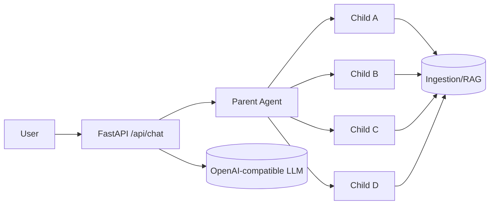
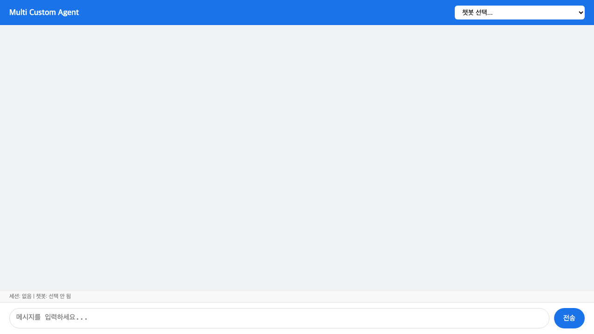
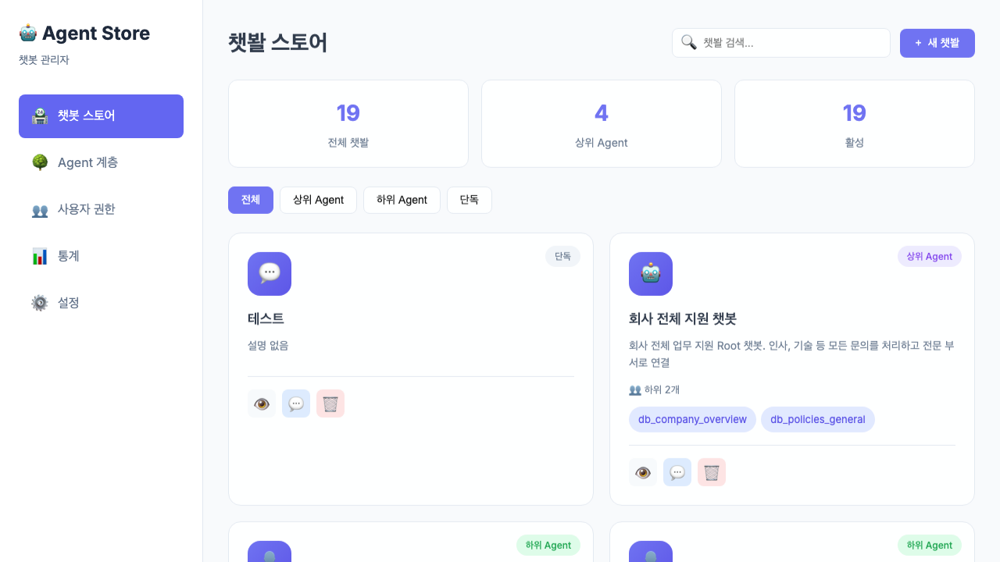

# Multi Custom Agent Service 발표자료 (Draft)

> 작성 기준: 실제 서버 구동 + 화면 캡처 반영

---

## Slide 1. Executive Summary

- **목표**: 사내 지식 질의 응답을 팀 전문성 중심으로 고도화
- **핵심**: Parent-Child 계층 위임 + RAG + 권한제어
- **효과**: 답변 정확도/속도/거버넌스 동시 개선

---

## Slide 2. 제품 포지셔닝

| 항목 | 일반 챗봇 | Multi Custom Agent |
|---|---|---|
| 도메인 전문성 | 단일 모델 의존 | 팀별 챗봇 분화 + 협업 |
| 답변 방식 | 단일 응답 | 위임/종합 응답 |
| 운영 유연성 | 코드 변경 중심 | JSON 선언형 운영 |
| 권한 관리 | 단순 | 사용자-챗봇 단위 통제 |

---

## Slide 3. 시스템 개요

---

## Slide 4. 실제 구동 화면 — 사용자 채팅 UI

- 실시간 SSE 스트리밍 기반
- 챗봇 선택 + 세션 기반 대화

---

## Slide 5. 실제 구동 화면 — 관리자 패널

- 챗봇 생성/수정/삭제
- 권한/운영 정책 관리

---

## Slide 6. 실제 구동 화면 — 계층 관리 뷰

- Parent-Child 구조 시각화
- 운영자가 위임 구조를 직관적으로 확인 가능

---

## Slide 7. 핵심 기능

1. **멀티 테넌트 챗봇**: 챗봇별 DB/프롬프트/모델 분리
2. **계층형 위임**: Parent→Child 및 다중 응답 종합
3. **권한 제어**: Knox ID + chatbot access
4. **운영 가시성**: 위임 경로, 후보 스코어 표시

---

## Slide 8. 사용자 사용 흐름

1. 챗봇 선택
2. 질문 입력
3. Parent가 신뢰도/정책으로 직접 답변 또는 위임
4. 필요 시 Child 응답 종합
5. 최종 답변 반환

---

## Slide 9. 도입 효과

- **정확도 향상**: 도메인 챗봇 협업
- **응답 품질 안정화**: 위임 정책 기반 제어
- **운영 효율**: JSON 기반 빠른 온보딩
- **보안 준수**: 권한 없는 챗봇 접근 차단

---

## Slide 10. 데모 시나리오 제안

### Demo A
- Parent가 답 가능한 질문 → 직접 답변

### Demo B
- 팀 교차 질문 → Child 협업 종합

### Demo C
- 권한 없는 접근 시 403 메시지 확인

---

## Slide 11. 운영 체크포인트

- 위임 임계값(`delegation_threshold`) 조정
- 병렬 하위 실행 수(`max_parallel_subs`) 조정
- child 라우팅 정확도(`policy.keywords`) 보정
- 로그 기반 오선택 분석(kw/emb/hybrid)

---

## Slide 12. 결론

**Multi Custom Agent는 조직 지식을 ‘질문 1회’로 연결하는 실무형 AI 오케스트레이션 플랫폼**입니다.

- 빠르게 도입 가능
- 팀 단위 확장 가능
- 권한/운영 통제 가능
