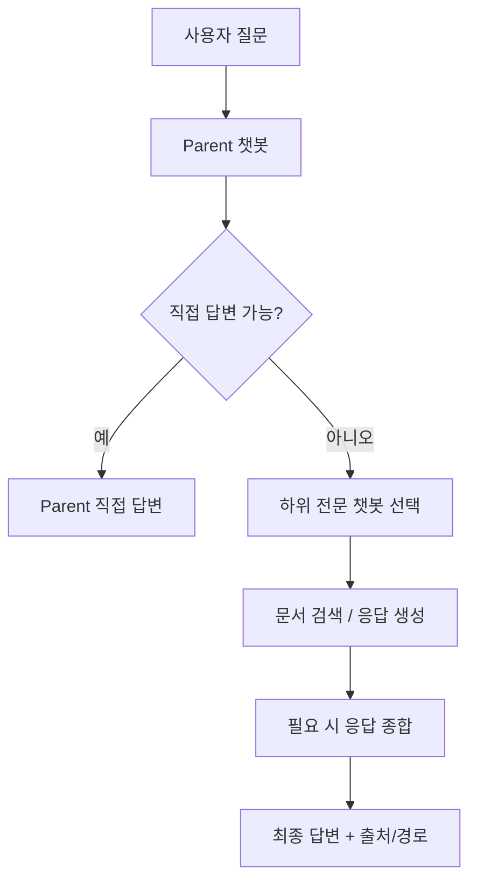

# Multi Custom Agent Service 발표자료

> 목적: 사내 이해관계자 대상 소개 / 파일럿 제안 / 데모 진행
> 기준: 실제 구동 화면 캡처 반영, 수치/효과는 **예시 KPI**로 표기

---

## Slide 1. 서비스 한 줄 소개

**Multi Custom Agent Service**는
사내 문서와 조직 구조를 반영해,
**전문 챗봇들이 협업 답변하는 엔터프라이즈 AI 오케스트레이션 플랫폼**입니다.

### 핵심 메시지
- 질문 1회로 관련 팀의 지식을 연결
- 챗봇 단위 권한 통제로 보안/거버넌스 확보
- JSON 기반 운영으로 신규 챗봇 추가/수정이 빠름

### 발표 멘트
> "단일 챗봇이 모든 걸 억지로 답하는 방식이 아니라, 조직의 역할 구조를 반영해 적절한 에이전트가 협업하는 구조입니다."

---

## Slide 2. 해결하려는 문제

| 문제 | 현업에서 보이는 현상 |
|---|---|
| 지식 분산 | 문서, 위키, 메신저, 담당자 기억 속에 정보가 흩어짐 |
| 전문가 병목 | 특정 팀/담당자에게 질문이 집중됨 |
| 답변 일관성 부족 | 사람마다 다른 답을 주거나 최신 정보 반영이 늦음 |
| 접근 통제 필요 | 누구나 모든 문서/챗봇에 접근하면 안 됨 |

### 메시지
- 문제는 "문서가 없음"이 아니라 **찾기 어렵고 연결이 안 된다는 점**
- 조직 구조와 권한 체계를 반영한 챗봇 운영이 필요

---

## Slide 3. 서비스 방식

### 특징
- Parent가 질문을 1차 해석
- Child는 도메인/팀 전문 응답 담당
- 필요 시 다중 하위 응답을 종합
- 응답 경로와 출처를 확인 가능

---

## Slide 4. 실제 화면 — 사용자 채팅 UI

### 보여줄 포인트
- 실시간 스트리밍 응답
- 세션 기반 대화 유지
- 챗봇 선택 후 바로 질의 가능
- 표 형태 응답 등 가독성 개선 가능

---

## Slide 5. 실제 화면 — 관리자 패널

### 보여줄 포인트
- 챗봇 생성/수정/삭제
- 설명, system prompt, policy, hierarchy 관리
- 운영자가 코드 수정 없이 챗봇을 관리할 수 있음

---

## Slide 6. 실제 화면 — 계층 구조 관리

### 보여줄 포인트
- Parent-Child 구조 시각화
- 어떤 챗봇이 어떤 역할을 맡는지 한눈에 파악
- 조직 구조 변화에 맞춘 위임 체계 확장 가능

---

## Slide 7. 주요 기능

| 구분 | 설명 |
|---|---|
| 멀티 챗봇 운영 | 챗봇별 DB, 프롬프트, 역할, 정책 분리 |
| 계층형 위임 | Parent → Child 구조로 전문 응답 유도 |
| RAG 검색 | Ingestion 서버 연동 문서 기반 답변 |
| 권한 제어 | Knox ID + chatbot access 기반 접근 통제 |
| 운영 가시성 | 위임 경로, 후보 점수, 출처 확인 |
| 빠른 운영 | JSON 선언형 설정으로 신규 챗봇 온보딩 용이 |

---

## Slide 8. 사용 시나리오

### 시나리오 A — Parent 직접 답변
- 질문: "이번 프로젝트 진행 현황 요약해줘"
- 기대: Parent가 자체 검색 결과로 즉시 답변

### 시나리오 B — 전문 Child 위임
- 질문: 특정 모듈/팀 약어 기반 세부 이슈
- 기대: 관련 Child가 전문 답변 수행

### 시나리오 C — 다중 응답 종합
- 질문: 여러 팀 정보가 필요한 교차 질의
- 기대: 여러 Child 결과를 종합해 최종 응답 생성

### 시나리오 D — 권한 통제
- 권한 없는 챗봇 접근 시 명확한 오류 메시지 반환

---

## Slide 9. 도입 이점

### 조직 관점
- 팀 지식 사일로 완화
- 반복 질의 자동화
- 응답 속도 향상
- 권한 기반 안전한 활용

### 운영 관점
- 챗봇별 정책 분리 운영
- 환경/권한/위임 정책 디버깅 가능
- 신규 팀/프로젝트 챗봇 확장 용이

### 예시 KPI(파일럿에서 확인)
- 반복 문의 처리 시간 단축
- 자주 묻는 질문 자동 응답 비율
- 사용자 만족도/재사용률
- 권한 오류/오답 케이스 감소

---

## Slide 10. 도입/운영 방식

### 추천 도입 순서
1. 파일럿 대상 팀 선정
2. Parent/Child 구조 설계
3. 문서 인덱싱 및 권한 설정
4. 데모/시범 운영
5. 피드백 반영 후 확장

### 추천 파일럿 범위
- FAQ가 많고 문서가 이미 있는 팀
- 담당자 문의가 반복적으로 몰리는 영역
- 보안/권한 통제가 명확한 챗봇부터 시작

---

## Slide 11. 발표 시 강조 포인트

- 이 서비스는 "거대한 범용 챗봇"이 아니라 **조직형 AI 운영 체계**임
- 중요한 차별점은 **위임 구조, 권한 통제, 운영 가능성**
- 기술 데모보다도 "업무 흐름을 어떻게 바꾸는가"를 강조하는 것이 좋음

---

## Slide 12. 마무리

> **한 번의 질문으로, 조직의 전문가 지식을 연결하는 플랫폼**

### 제안
- 먼저 소규모 파일럿으로 운영 적합성 확인
- Parent/Child 구조와 권한 정책을 함께 검증
- 효과가 확인되면 팀 단위로 점진 확장

### 부록
- 프로모션 요약본: `PROMOTION_KIT_2026-04.md`
- 원페이지 자료: `promo-onepager.html`
- 발표자 노트: `TALK_TRACK_NOTES.md`
