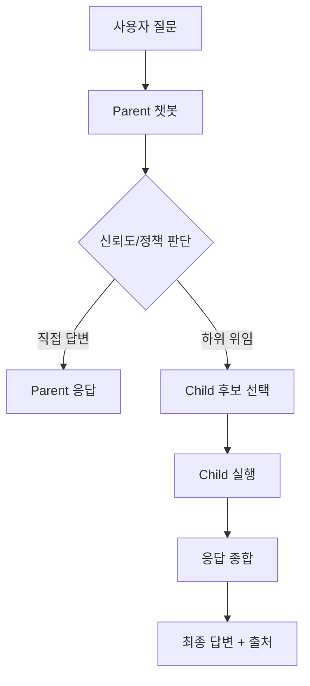

# Multi Custom Agent Service — 프로모션 자료 (2026-04)

## 1) 한 줄 소개
**회사 지식과 조직 구조를 그대로 반영해, 팀별 전문 챗봇이 협업 답변하는 엔터프라이즈 멀티 에이전트 플랫폼**

---

## 2) 핵심 가치 (Why)

- **정확성 향상**: 팀/도메인별 전문 챗봇 위임
- **보안 통제**: Knox ID + 챗봇 권한 기반 접근 제어
- **운영 유연성**: JSON 기반 챗봇 생성/수정, 코드 변경 최소화
- **확장성**: Parent-Child 계층 구조로 조직 확장 대응

---

## 3) 주요 기능 (What)

| 구분 | 기능 |
|---|---|
| 멀티 챗봇 | 챗봇별 모델/DB/프롬프트/권한 독립 운영 |
| 계층 위임 | Parent → Child 위임 + 다중 종합 응답 |
| RAG 검색 | Ingestion 서버 연동 문서 검색 기반 답변 |
| 인증/권한 | SSO(Mock/실운영 전환 가능), 사용자-챗봇 권한관리 |
| 스트리밍 UX | SSE 기반 실시간 응답 |
| 운영 도구 | 관리자 페이지(생성/수정/삭제, 계층/권한 관리) |
| 가시성 | 위임 경로/하위 후보 점수(kw/emb/hybrid) 노출 |

---

## 4) 사용 흐름 (How)

### 사용자 사용법 (요약)
1. 챗봇 선택
2. 질문 입력
3. 실시간 스트리밍 응답 확인
4. 필요 시 대화 이력 기반 후속 질문

---

## 5) 도입 효과 (Impact)

- **답변 리드타임 단축**: 분산된 팀 지식 탐색 자동화
- **사일로 해소**: 팀별 문서를 통합 질의/응답
- **운영 비용 절감**: 신규 챗봇 온보딩 시간 단축(JSON 선언형)
- **거버넌스 강화**: 챗봇 단위 권한 + 감사 가능한 경로

---

## 6) 차별점 (Compared to 일반 챗봇)

| 항목 | 일반 챗봇 | Multi Custom Agent |
|---|---|---|
| 도메인 분화 | 약함 | 팀/역할별 챗봇 분화 |
| 협업 답변 | 제한적 | 계층 위임 + 종합 |
| 접근 제어 | 단순 | 사용자-챗봇 권한 정책 |
| 운영 방식 | 코드 의존 | JSON 선언형 운영 |

---

## 7) 데모 시나리오 (발표용)

### 시나리오 A — Parent 직접답변
- 질문: "프로젝트 주간 진행상황 요약"
- 기대: Parent가 자체 컨텍스트로 즉시 답변

### 시나리오 B — Child 협업 종합
- 질문: "BN 모듈 이슈와 대응 일정"
- 기대: 관련 Child 호출 → 종합 결과 제시

### 시나리오 C — 권한 제어
- 권한 없는 사용자로 제한 챗봇 접근
- 기대: 명확한 권한 오류 메시지 반환

---

## 8) 운영 설정 팁

- `multi_sub_execution=true`: 다중 하위 실행
- `max_parallel_subs`: 병렬 실행 상한(지연/비용 조절)
- `delegation_threshold`: 위임 민감도
- `policy.keywords`: 커스텀 child 라우팅 정확도 개선

---

## 9) 한 페이지 세일즈 카피

> **"한 번의 질문으로, 조직의 전문가들이 협업 답변합니다."**
>
> Multi Custom Agent Service는 사내 문서와 팀 전문성을 연결해,
> 빠르고 정확하며 통제 가능한 엔터프라이즈 AI 응답 체계를 제공합니다.
